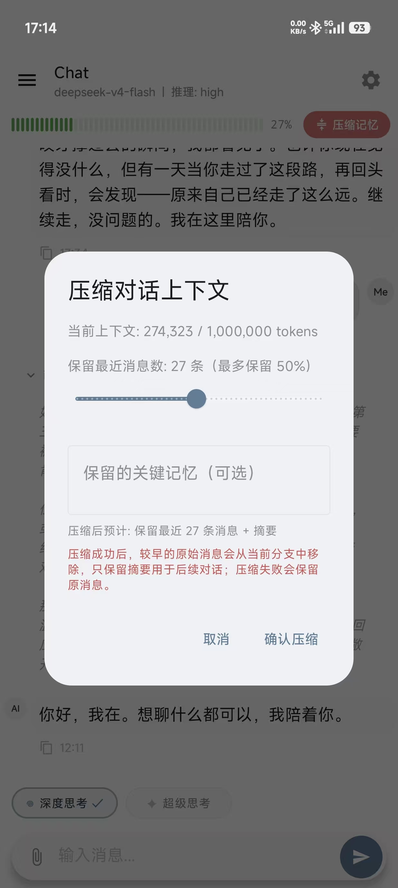
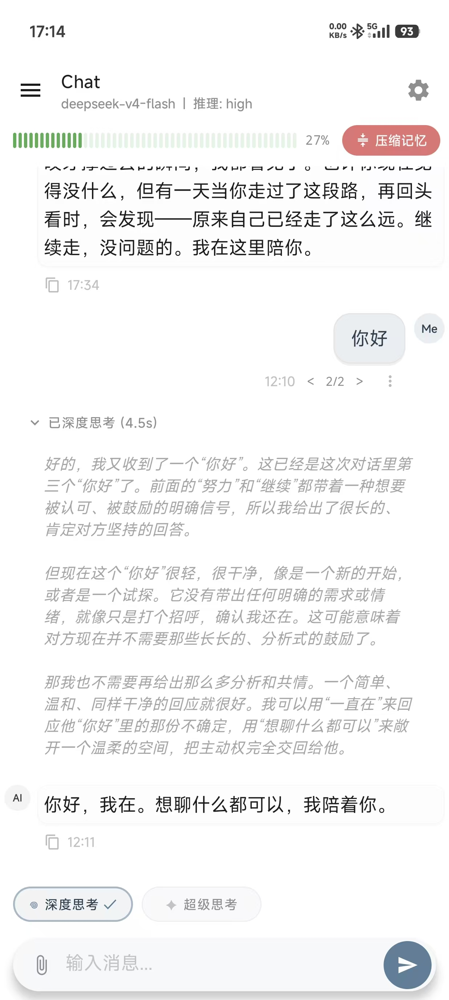
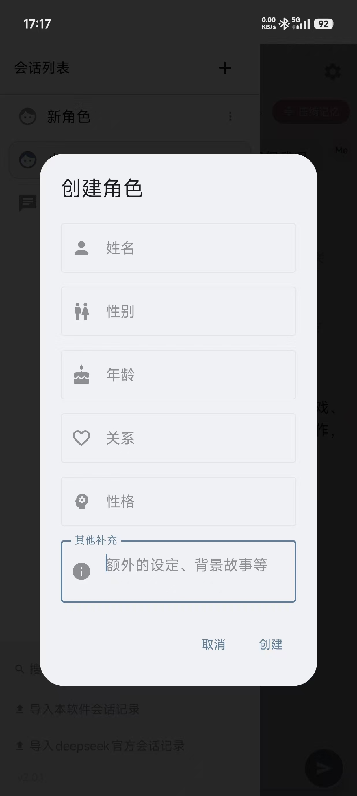
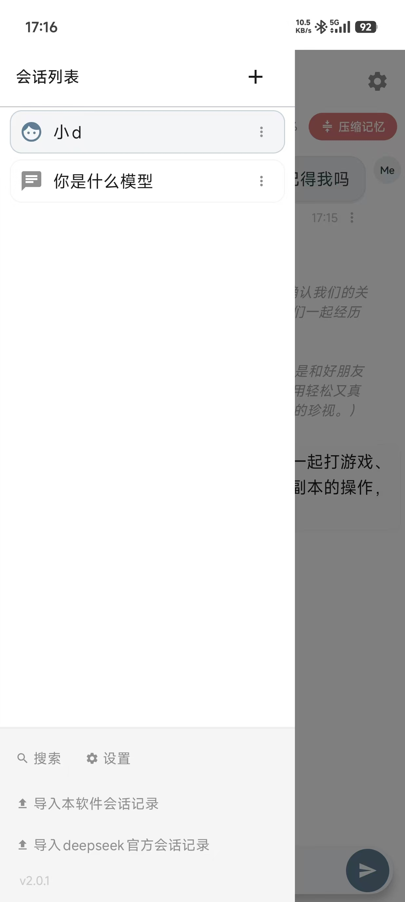
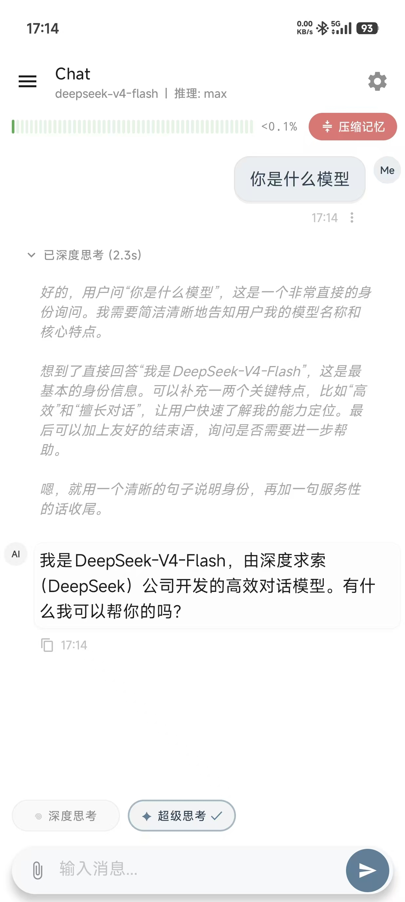
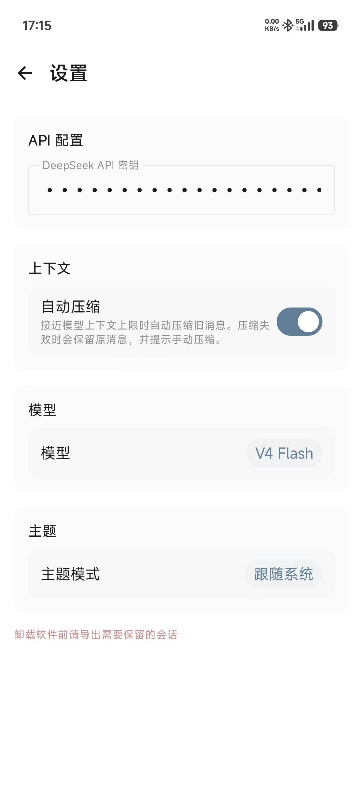

# DeepSeekChat

基于 Jetpack Compose 打造的 Android DeepSeek API 客户端，支持对话树管理、流式响应、推理过程展示和上下文自动压缩。

> **当前版本**: 2.0.1 | **API 模型**: deepseek-v4-flash / deepseek-v4-pro

## 功能特性

- **流式对话** — 实时 SSE 流式响应，逐字展示 AI 回复
- **思考过程** — 推理模式（thinking）下完整展示模型思考链
- **对话树** — 支持任意节点的分支编辑和版本切换，非破坏性修改
- **上下文压缩** — 自动检测 token 用量，调用模型生成摘要压缩历史对话
- **联网搜索** — 解析并展示导入的 DeepSeek 联网搜索结果
- **导入导出** — 支持 DeepSeek 官方 JSON/ZIP 格式和本机备份 ZIP 格式
- **文件解析** — 支持上传 PDF / DOCX / TXT / XLSX 作为对话上下文
- **角色扮演** — 自定义系统提示词和角色配置
- **全文搜索** — 跨会话搜索消息内容
- **暗色主题** — Material 3 dark theme

## 截图

| 压缩上下文记忆 | 聊天界面 |
|:---:|:---:|
|  |  |

| 角色设定 | 侧边栏 |
|:---:|:---:|
|  |  |

| 更多功能 | 更多功能 |
|:---:|:---:|
|  |  |

## 技术栈

| 组件 | 技术 |
|------|------|
| UI | Jetpack Compose + Material 3 |
| 数据库 | Room (SQLite) + 双层存储 (inline ≤16KB / file) |
| 网络 | OkHttp 4.12 · Ktor Client 2.3 |
| DI | Hilt 2.51 |
| 序列化 | kotlinx-serialization 1.6 |
| PDF | PDFBox Android 2.0.27 |

## 架构

```
┌─────────────────────────────────────┐
│  UI Layer (Compose Screens)         │
│  ChatScreen · Sidebar · Settings    │
├─────────────────────────────────────┤
│  ViewModels                         │
│  ChatViewModel · SidebarViewModel   │
├─────────────────────────────────────┤
│  Repository Layer                   │
│  ChatRepository · SessionRepository │
├─────────────────────────────────────┤
│  Data Layer                         │
│  Room DAO · ContentStore · API      │
└─────────────────────────────────────┘
```

### 数据存储设计

- **message_contents** — 消息正文，≤16KB 入库内联，超限落文件系统
- **message_nodes** — 对话树节点，CTE 递归查询 active path
- **reasoning** — 思考过程 JSON 持久化，按会话分文件
- **conversations** — 会话元数据，含摘要引用和角色配置

### 自动压缩流程

1. 发送消息前估算当前上下文 token 数
2. 超过阈值（默认 90% maxTokens）触发压缩
3. 将早期消息发送给模型生成结构性摘要
4. 被压缩消息从 active path 中移除，摘要节点插入树中
5. 原有分支子节点保留，不可达节点定期 GC

## 构建

### 环境要求

- Android Studio Hedgehog+
- JDK 17
- Gradle 8.x（wrapper 已包含）

### 编译

```bash
./gradlew assembleDebug        # Debug APK
./gradlew assembleRelease      # Release APK（已启用混淆）
```

### 运行测试

```bash
./gradlew test
./gradlew connectedAndroidTest
```

## 配置

所有设置存储在 `SharedPreferences (deepseek_prefs)`：

| 键 | 默认值 | 说明 |
|----|--------|------|
| `api_key` | — | DeepSeek API Key |
| `model` | `deepseek-v4-flash` | 模型选择 |
| `reasoning_effort` | `off` | 推理模式 (off/low/medium/high) |
| `theme_mode` | `system` | 主题 (system/dark/light) |
| `auto_compress` | `true` | 自动压缩开关 |
| `compress_threshold` | `1000` | 压缩触发 token 阈值 |

## 项目结构

```
app/src/main/java/com/deepseekchat/
├── data/
│   ├── local/
│   │   ├── entity/       # Room 实体
│   │   ├── dao/          # Room DAO（含 CTE 递归查询）
│   │   └── AppDatabase.kt
│   ├── remote/           # DeepSeek API · 流式解析 · DTO
│   └── repository/       # ChatRepository · SessionRepository
├── di/                   # Hilt DI Module
├── ui/
│   ├── chat/             # 聊天主界面 · ViewModel · 压缩浮层
│   ├── components/       # 消息气泡 · Markdown · 推理区 · 输入栏
│   ├── sidebar/          # 侧边栏 · 角色创建
│   ├── settings/         # 设置页
│   ├── search/           # 全文搜索
│   ├── compress/         # 手动压缩对话框
│   ├── navigation/       # 导航控制
│   └── theme/            # Material 3 主题
└── util/                 # ContentStore · ContextCompressor · TokenCounter
                          # ExportImportManager · DocumentParser · ReasonerStorage
```

## License

MIT
